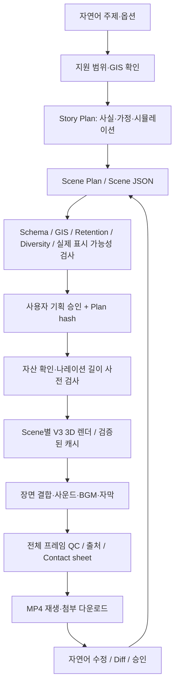

# Architecture

프로그램은 자연어 입력을 바로 MP4로 변환하지 않습니다. 계획을 저장하고 검수한 뒤 정확히 그 계획을 승인받아 렌더링합니다.

## 모듈 경계

| 모듈 | 책임 |
|---|---|
| `engine/planner.py` | 지원 가능한 주제 분석, 인과 사건·대본·Scene 구성 |
| `engine/gis.py` | 공개 원본 좌표 확인, 구면 거리, 출처 있는 해상 경로 |
| `engine/schema.py` | JSON Schema·사실 구분·GIS·시간·Scene 경계 검증 |
| `engine/retention.py` | 의미 있는 사건의 간격·다양성·훅·변수·Peak·보상·인과관계 |
| `engine/visibility.py`, `tools/semantic_preflight.mjs` | 동결된 V3 adapter의 30fps 카메라·가림·이벤트 primitive·폰트 배치를 사용한 렌더 전 가시성 검사 |
| `engine/presets.py` | 검증 가능한 카메라·조명·연출 프리셋 |
| `engine/plugins.py` | 현재 기능과 미설치 확장 모듈의 capability 계약 |
| `engine/storage.py` | 프로젝트·계획 버전·정확한 해시 승인·작업 상태 |
| `engine/revisions.py` | 자연어 수정의 범위 선택, 변경점, 승인된 새 버전 |
| `engine/advanced_revisions.py` | Scene 삭제·결론 지연의 실제 구조 변화와 필요한 인접 Scene 연결 |
| `web/earth_adapter.js` | 기존 V3 셰이더·PBR 모델을 Scene JSON에 연결 |
| `engine/rendering.py` | 장면별 렌더·캐시·체크포인트·조립 |
| `engine/backends.py` | CPU 실행, GPU의 비용 승인·수명주기 계약 |
| `engine/estimation.py` | 현재 시각 렌더러와 일치하는 QC 합격 실측 기록으로 캐시 없는 장면 계산 비용을 예측 |
| `engine/audio.py` | 교체 가능한 TTS, 효과음 타임라인, 음악·ducking·자막 |
| `engine/narration.py` | 나레이션의 같은 Scene 사건·주장·GIS 참조 검증과 실제 Scene 발화 구간 기록 |
| `engine/qc.py` | 실제 인코딩 프레임·오디오·렌더 감사·주요 프레임 검사 |
| `server.py`, `web/` | 모바일 대응 기획·승인·진행률·다운로드·수정 화면 |

## V3 재사용 방식

서버는 기존 `renderer_v3.js`의 클래스를 제공하는 bridge를 만들고 기존 파일을 수정하지 않습니다. `SceneEarthRenderer`가 V3 `Renderer`를 상속해 Scene별 카메라, 경로, 이동체, 조명과 라벨을 교체합니다. 원본 V3 영상이나 고정 서울→도쿄→싱가포르 타임라인을 반복하지 않습니다.

재사용되는 핵심은 8K 표면·야간광·구름, 구체 지구, Rayleigh 대기, HDR 합성·톤매핑, 깊이/속도 기반 motion blur, 발광 항로 재질, 원본 3D 항공기입니다. 지리 설명 장면은 별도 가독성 조명으로 지표 노출과 구름 투명도를 조정합니다. 물리·기상 예측이나 고정밀 DEM 엔진으로 설명하지 않습니다.

## 계획과 상태

각 Scene은 렌더 관련 설정, 사실 상태, 출처, 사건·사운드 timestamp, 나레이션, `entry_state/exit_state`, 선택적 역사 시간과 영상 클립 슬롯을 가집니다. 장면의 시작·끝 카메라는 경계 상태와 일치해야 하고 앞 장면의 exit가 다음 entry와 같아야 합니다. 국경·지형 변화를 실행하는 기능은 해당 플러그인이 설치되기 전까지 차단합니다.

`FACT`는 출처를 참조하고, `SIMULATION`은 명시된 `ASSUMPTION`을 참조합니다. 좌표는 로컬의 실제 GIS 원본에서 가져옵니다. 장소를 찾지 못하면 임의 좌표를 생성하지 않습니다.

카메라 rig의 위치는 지명 좌표와 별도입니다. 각 경계의 카메라 anchor는 출처 있는 주 경로의 누적 구면 길이와 진행률에서 계산하며 `metadata.camera_provenance`에 계산법과 원본 source IDs를 기록합니다. 해상 경로도 모든 라이선스 있는 waypoint를 따라 보간합니다. 이를 새 항구나 도시 위치로 등록하지 않습니다. 거리 milestone은 실제 Scene-local smoothstep 진행과 같은 방식으로 계산하며 항공편 소요 시간·선박 운항 예측과 구분합니다.

마지막 카메라는 전체 주 경로 샘플의 구면 convex-hull focus와 실제 9:16 rig 투영으로 framing을 계산합니다. 마지막 도시만 향하는 카메라로 끝내지 않고 주 경로와 노드가 화면 안전영역에 들어오는지, 지구 뒤쪽으로 가려지지 않는지 검사합니다. 해당 framing은 `metadata.final_overview`에 남깁니다. 현재 한 전경에 담을 수 없는 연결망은 `MULTI_HEMISPHERE_OVERVIEW`로 차단하며 여러 전경으로 나누는 기획이 필요합니다.

`story.pattern`은 항공의 여정→네트워크 공개, 해상의 차단→우회→네트워크, 가상 경로 선택→비교, 국가 위치→비교처럼 도메인별 인과 구조를 기록합니다. 네 가지 지원 스타일은 실제 조명, 카메라 속도와 프리셋 선택을 바꿉니다. 알 수 없는 스타일은 기본값으로 강제 변환하지 않습니다.

의미 있는 사건은 도시·새 경로·출발·도착·변수·대응·관계·규모·결과 공개입니다. 줌·pan·glow·particle 자체는 사건으로 계산하지 않습니다. Retention Gate는 구성의 규칙을 검증하며 실제 시청 유지율을 예측하지 않습니다.

스키마·출처·지원 모듈·Retention이 통과한 계획은 별도 semantic visibility 검사도 통과해야 합니다. 이 검사는 WebGL을 실행하지 않고 실제 adapter의 매 프레임 카메라·투영·지구 가림·경로/이동체/표시 영역을 계산합니다. 화면 밖 도시 강조, 실제로 없는 물리 사건, 너무 늦거나 짧은 정보 표시를 차단합니다. 기획기는 출처 있는 이동 중 경로의 남은 거리처럼 검증 가능한 정보로 일부 보조 사건을 수정할 수 있으며 변경 기록을 남깁니다. 출발·도착·차단·네트워크 같은 물리 사건을 문구로 대신 통과시키지 않습니다.

나레이션은 같은 Scene에 실제로 존재하는 사건을 참조해야 합니다. 중복·삭제된 사건·다른 Scene의 사건·잘못된 주장 참조는 승인 전에 차단합니다. `narration_alignment.json`에는 확인된 사건/지리/주장 참조와 실제 합성 음성의 Scene별 발화 구간을 연결해 기록합니다. 외부 음성의 사용자 제공 큐와 측정된 합성 구간을 구분하며 TTS가 꺼져 있으면 발화 시각을 측정했다고 표시하지 않습니다. 이 구조는 Scene 단위 문맥 연결이며 문장 의미의 자동 사실 검증, ASR 또는 단어별 강제 정렬을 제공하지 않습니다.

저장된 `gate.passed` 값은 승인 근거로 신뢰하지 않습니다. 정규화된 렌더 입력을 저장할 때, 승인할 때, 렌더를 시작할 때 다시 검증합니다. 의미 입력·검사 코드·adapter·폰트 해시가 같을 때만 분리된 검사 결과를 재사용합니다. 외부 클립은 출처·라이선스·실제 파일 내용과 길이·annotation 표시 계약을 별도로 확인합니다. 이 예측 검사는 실제 픽셀의 지형 가독성·음질·영상미를 보증하지 않으므로 렌더 후 전체 프레임 QC와 재생 검수도 수행합니다.

## 승인, 버전, 캐시

`scene_plan.json`은 버전별 저장됩니다. 승인 문서는 해당 plan hash에 묶여 있으며 계획이 바뀌면 예전 승인을 재사용할 수 없습니다. 자연어 수정은 먼저 Diff를 저장하고 승인 후 `v002` 등 새 버전을 만듭니다. 기존 Scene·최종 MP4는 보존합니다.

Scene 삭제는 장면 ID를 재번호 매기지 않고 실제 Scene을 제거해 전체 길이를 줄입니다. 뒤쪽 조립 시간과 기존 사건의 실제 선행 원인 참조를 수정하고, 삭제 구간 바로 다음 Scene의 entry/camera/진행률을 살아남은 앞 Scene에 연결합니다. 따라서 삭제 Scene 외에 연결에 필요한 바로 다음 Scene도 재렌더 대상이 될 수 있습니다. 훅·Peak·결말까지 삭제하면 계획을 차단하며 삭제한 내용을 몰래 되살리지 않습니다.

결론 지연은 자막만 숨기는 것이 아닙니다. 결과 사건·나레이션·사운드와 결론을 미리 드러내는 네트워크 표현을 뒤쪽 Scene으로 이동하고 필요한 후속 Scene의 상태를 연결합니다. 원래 장면의 빈 자리에 실제 GIS 출처로 확인된 지리 정보가 들어갈 수 있지만, 유효한 대체 정보가 없거나 발화·사건 밀도·경계 규칙이 깨지면 수정 계획이 실패합니다. `revision.blocking_issues`는 저장되며 승인 시에도 검증합니다. 마지막 Scene에서 결론을 뒤로 미루려는 요청에는 옮길 Scene이 없다는 오류를 제공합니다.

캐시 키는 Scene의 시각 입력, 자산 SHA, 시각 렌더러 버전, 품질과 `render_context`로 구성합니다. 저장 시 각 Scene의 `render_time_offset`을 고정해 구름·셰이더·dither의 렌더 시계를 보존하고, `render_context`의 조명/태양·HERO anchor를 고정합니다. 첫 Scene 여부와 화면에 표시되는 훅도 문맥 키에 포함합니다. 현대 Scene에서 조립 시간·현대 시간축의 `timeline_position`·사건 인과 참조만 바뀌는 경우 해당 항목을 시각 키에서 제외해 삭제 뒤의 동일 프레임을 재사용합니다. 실제 항로 진행률은 시각 입력으로 남습니다. 역사 연도·era나 실제 시각 상태 변경은 이 예외로 처리하지 않습니다.

현재의 전체 Scene JSON SHA와 캐시를 만든 Scene JSON SHA는 별도로 남기며 `.reuse.json`에 정규화 범위와 실제 MP4/감사 SHA를 기록합니다. 캐시의 MP4와 감사 JSON SHA 및 실제 미디어 규격이 일치해야 재사용합니다. 사용자 제공 영상은 그 파일의 내용 SHA를 해당 Scene 키에 포함합니다. 손상된 캐시는 삭제하거나 덮어쓰지 않고 복구 결과를 별도로 보존합니다. 시각 코드와 관계없는 UI 코드 변경이나 프로젝트 오디오 옵션 변경 때문에 모든 지구 Scene을 다시 계산하지 않습니다.

작업 상태와 장면별 체크포인트는 디스크에 저장됩니다. 서버 재시작 시 실행 중 작업은 `interrupted`로 복구되고 완료 Scene은 그대로 재사용합니다. 서버 프로세스가 종료되면 렌더가 자동으로 계속 실행된다고 주장하지 않습니다. 재실행 후 저장된 프로젝트를 열어 이어서 생성합니다.

## 현재 제한

오프라인 기획기는 검증된 장소·항로를 사용하는 제한된 도메인 기획기입니다. 임의 주제의 인터넷 팩트 조사와 무제한 언어 이해는 제공하지 않습니다. 해상 시나리오는 출처가 검증된 로테르담–싱가포르의 수에즈/희망봉 비교에 한정됩니다. 육상 경로 그래프가 없어 `LAND_ROUTING`은 차단합니다. historical 필드는 확장 계약이며 실제 과거 지리 데이터는 설치되지 않았습니다. 과거 지도·영토·국경 설명은 `HISTORICAL_GIS`/`TIME_MORPH` 등의 요구를 반환합니다.

선박과 항공기는 지도 가독성을 위해 확대된 3D 프록시입니다. 해상 이동 경로는 수면 부근의 출처 있는 waypoint 경로이고, 발광 경로는 동일한 경위도의 시각 오버레이로 약 3km 높이에서 표시합니다. 선박 프록시는 지표를 관통하지 않도록 모델 하단에 최소 가시 여유를 둡니다. 실제 선박 크기·고도·수심·항해 정밀도를 표현하는 공학 시뮬레이션이 아닙니다. 프레임 감사는 물리 경로와 표시 오버레이를 구분합니다. 미래 플러그인과 GPU backend는 인터페이스와 거절 동작을 갖추며 실제 시각 구현/호스팅 제공과 구분합니다.
